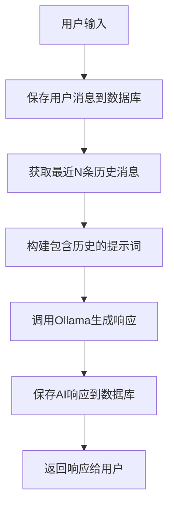

# 对话存储和记忆系统指南

## 📚 概述

LoopcruiseTheatre现在具备完整的**对话存储和记忆功能**，让AI Agent能够：

- 🧠 **记忆对话历史** - 理解上下文，生成连贯的剧情
- 💾 **持久化存储** - 对话内容保存在本地SQLite数据库
- 🔍 **智能检索** - 搜索历史对话，分析对话统计
- 📊 **数据管理** - 导出、清理、统计对话数据

## 🏗️ 数据存储架构

### 数据库设计

```sql
-- 对话会话表
conversation_sessions
├── session_id (主键)
├── script_title (剧本标题)
├── script_content (完整剧本)
├── agent_model (使用的AI模型)
├── created_at/updated_at (时间戳)
└── metadata (元数据JSON)

-- 对话消息表  
conversation_messages
├── id (自增主键)
├── session_id (会话ID)
├── message_type (user/assistant/system/narrator)
├── role (player/npc/dm/system)
├── speaker_name (发言者名称)
├── content (消息内容)
├── metadata (置信度、情感等)
└── created_at (创建时间)

-- 对话总结表
conversation_summaries
├── id (自增主键)
├── session_id (会话ID)
├── summary_content (总结内容)
├── message_count (消息数量)
└── 时间范围字段
```

### 存储位置

```
server/
├── data/
│   ├── conversations.db    # SQLite数据库
│   └── .gitkeep           # 目录标记
└── app/
    ├── database/          # 数据库模块
    │   ├── models.py      # 数据模型
    │   └── sqlite_storage.py # 存储实现
    └── agents/
        └── memory_agent.py # 带记忆的Agent
```

## 🤖 Agent记忆机制

### MemoryEnhancedAgent特性

```python
# 旧版Agent（无记忆）
OllamaAgent
├── 每次对话都是独立的
├── 无法记住之前的剧情发展
└── 只能基于剧本生成内容

# 新版Agent（带记忆）
MemoryEnhancedAgent
├── 自动保存每条对话到数据库
├── 构建提示词时包含历史上下文
├── 理解剧情连续性和角色发展
└── 支持长期会话管理
```

### 记忆工作流程



## 🔧 API接口详解

### 1. Agent接口 (升级版)

原有的Agent接口现在自动支持记忆功能：

```http
# 加载剧本（会自动保存到数据库）
POST /api/v1/agent/load_script
{
  "session_id": "sess_123",
  "script_text": "剧本内容..."
}

# AI对话（现在支持上下文记忆）
POST /api/v1/agent/chat  
{
  "session_id": "sess_123",
  "message": "根据之前的剧情，接下来会发生什么？",
  "stream": true
}
```

### 2. 对话管理接口 (全新)

#### 获取对话历史
```http
GET /api/v1/conversation/history/{session_id}?limit=50&offset=0

响应：
{
  "session_id": "sess_123",
  "messages": [
    {
      "id": 1,
      "message_type": "user",
      "speaker_name": "玩家", 
      "content": "我想探索神秘的城堡",
      "created_at": "2024-01-15T10:30:00"
    },
    {
      "id": 2,
      "message_type": "assistant",
      "speaker_name": "城堡守卫",
      "content": "站住！你是什么人？",
      "metadata": {"confidence": 0.9},
      "created_at": "2024-01-15T10:30:15"
    }
  ],
  "total_count": 25,
  "page_info": {...}
}
```

#### 对话统计和摘要
```http
GET /api/v1/conversation/stats/{session_id}
GET /api/v1/conversation/summary/{session_id}

# 会话列表
GET /api/v1/conversation/sessions?limit=20

# 搜索对话
GET /api/v1/conversation/search/{session_id}?query=城堡&limit=10
```

#### 数据导出和管理
```http
# 导出完整对话
GET /api/v1/conversation/export/{session_id}

# 删除会话
DELETE /api/v1/conversation/session/{session_id}

# 清理旧数据
POST /api/v1/conversation/cleanup?days=30
```

## 💻 使用示例

### 前端JavaScript集成

```javascript
class ConversationManager {
  constructor(baseUrl = 'http://localhost:8000') {
    this.baseUrl = baseUrl;
  }

  // 获取对话历史
  async getHistory(sessionId, page = 1, limit = 20) {
    const offset = (page - 1) * limit;
    const response = await fetch(
      `${this.baseUrl}/api/v1/conversation/history/${sessionId}?limit=${limit}&offset=${offset}`
    );
    return response.json();
  }

  // 搜索对话
  async searchConversation(sessionId, query) {
    const response = await fetch(
      `${this.baseUrl}/api/v1/conversation/search/${sessionId}?query=${encodeURIComponent(query)}`
    );
    return response.json();
  }

  // 导出对话数据
  async exportConversation(sessionId) {
    const response = await fetch(`${this.baseUrl}/api/v1/conversation/export/${sessionId}`);
    const data = await response.json();
    
    // 下载为JSON文件
    const blob = new Blob([JSON.stringify(data, null, 2)], 
                          { type: 'application/json' });
    const url = URL.createObjectURL(blob);
    const a = document.createElement('a');
    a.href = url;
    a.download = `conversation_${sessionId}.json`;
    a.click();
  }

  // 获取对话摘要
  async getSummary(sessionId) {
    const response = await fetch(`${this.baseUrl}/api/v1/conversation/summary/${sessionId}`);
    return response.json();
  }
}
```

### Python客户端使用

```python
import aiohttp
import asyncio

class ConversationClient:
    def __init__(self, base_url="http://localhost:8000"):
        self.base_url = base_url
    
    async def get_conversation_history(self, session_id, limit=50):
        async with aiohttp.ClientSession() as session:
            url = f"{self.base_url}/api/v1/conversation/history/{session_id}"
            async with session.get(url, params={"limit": limit}) as resp:
                return await resp.json()
    
    async def analyze_conversation_patterns(self, session_id):
        """分析对话模式"""
        history = await self.get_conversation_history(session_id, limit=1000)
        messages = history["messages"]
        
        # 统计分析
        user_messages = [m for m in messages if m["message_type"] == "user"]
        ai_messages = [m for m in messages if m["message_type"] == "assistant"]
        
        return {
            "total_turns": len(user_messages),
            "avg_user_length": sum(len(m["content"]) for m in user_messages) / len(user_messages),
            "avg_ai_length": sum(len(m["content"]) for m in ai_messages) / len(ai_messages),
            "most_active_character": max(
                set(m["speaker_name"] for m in ai_messages),
                key=lambda x: sum(1 for m in ai_messages if m["speaker_name"] == x)
            )
        }

# 使用示例
async def main():
    client = ConversationClient()
    analysis = await client.analyze_conversation_patterns("sess_123")
    print(f"对话分析结果: {analysis}")
```

## 🧪 测试和验证

### 运行记忆功能测试

```bash
# 完整测试套件
cd server
python test_memory_agent.py

# 测试内容包括：
✓ 创建会话并加载剧本
✓ 多轮对话记忆测试  
✓ 对话历史查询
✓ 统计和摘要功能
✓ 搜索功能测试
✓ 数据导出功能
```

### 手动测试步骤

```bash
# 1. 启动服务
python start_server.py

# 2. 创建会话
curl -X POST http://localhost:8000/api/v1/stream/start \
  -H "Content-Type: application/json" \
  -d '{"hello": true}'

# 3. 加载剧本
curl -X POST http://localhost:8000/api/v1/agent/load_script \
  -H "Content-Type: application/json" \
  -d '{
    "session_id": "your_session_id",
    "script_text": "你的剧本内容..."
  }'

# 4. 进行对话
curl -X POST http://localhost:8000/api/v1/agent/chat \
  -H "Content-Type: application/json" \
  -d '{
    "session_id": "your_session_id",
    "message": "开始我们的冒险吧！",
    "stream": false
  }'

# 5. 查看对话历史
curl http://localhost:8000/api/v1/conversation/history/your_session_id
```

## ⚙️ 配置和优化

### 记忆配置参数

```python
# 在 memory_agent.py 中调整
class MemoryEnhancedAgent:
    def __init__(self, 
                 max_history_messages=10,  # 最大历史消息数
                 ...):
        self.max_history_messages = max_history_messages
```

### 数据库优化

```python
# 在 sqlite_storage.py 中
# 1. 调整数据库路径
storage = SQLiteConversationStorage("custom/path/conversations.db")

# 2. 定期清理
await storage.cleanup_old_sessions(days=30)

# 3. 数据库维护
# SQLite会自动优化，但可以手动执行：
# VACUUM; ANALYZE;
```

### 性能监控

```python
# 获取存储统计
stats = await storage.get_conversation_stats(session_id)
print(f"消息总数: {stats['total_messages']}")
print(f"存储大小: {os.path.getsize('data/conversations.db')} bytes")
```

## 🔒 数据安全和隐私

### 本地存储优势
- ✅ **完全本地** - 数据不离开您的设备
- ✅ **无网络传输** - 对话内容不发送到第三方
- ✅ **自主控制** - 您完全控制数据的存储和删除

### 数据管理建议
```bash
# 1. 定期备份数据库
cp data/conversations.db backups/conversations_$(date +%Y%m%d).db

# 2. 清理敏感数据
curl -X POST http://localhost:8000/api/v1/conversation/cleanup?days=7

# 3. 导出重要对话
curl http://localhost:8000/api/v1/conversation/export/important_session > export.json
```

## 🚀 未来扩展

### 计划中的功能
- 🔍 **向量搜索** - 基于语义的对话检索
- 📊 **高级分析** - 情感分析、话题建模
- 🎯 **个性化** - 基于历史的角色性格学习
- 🌐 **多格式导出** - Markdown、PDF等格式

### 扩展存储后端
```python
# 可以轻松扩展到其他数据库
class PostgreSQLStorage(BaseStorage):
    # 实现PostgreSQL存储
    pass

class MongoDBStorage(BaseStorage):  
    # 实现MongoDB存储
    pass
```

---

🎉 **现在您的AI Agent具备了完整的记忆能力！它能理解对话历史，生成连贯的剧情，并提供丰富的数据管理功能。**
